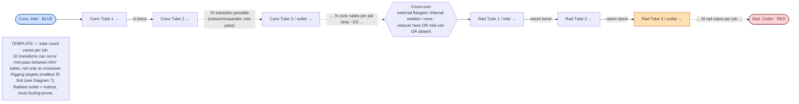

# Coil Template — Tube-Level Topology

Invariant coil topology only. Tube counts, crossover form, and ID-transition
points are per-job variables — read this as a template, not a spec.

---

## Diagram 2 — Tube-Level Coil Template (multi-size)

**Scope:** Invariant coil topology — serpentine reversal at each bend, conv → crossover → rad order. Tube count is a per-job variable (avg ~10 conv tubes). The crossover is a single abstracted node carrying all real-world variants (external flanged / internal welded / none; reducer present or absent). ID transitions via reducer/expander can occur **mid-pass between any tubes**, not only at the crossover. This is a TEMPLATE, not a spec.

