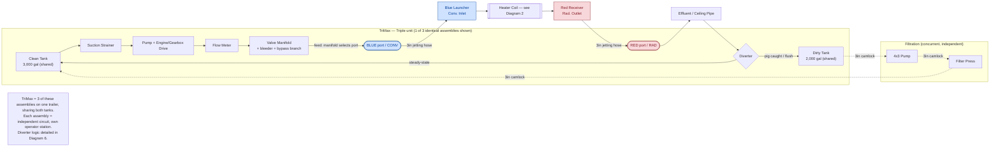
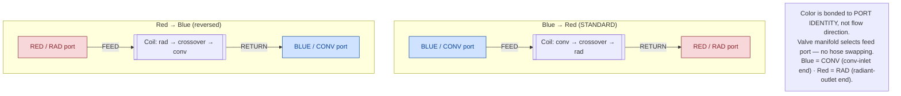
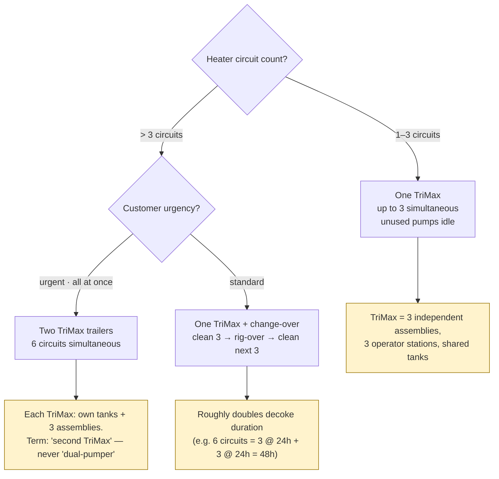
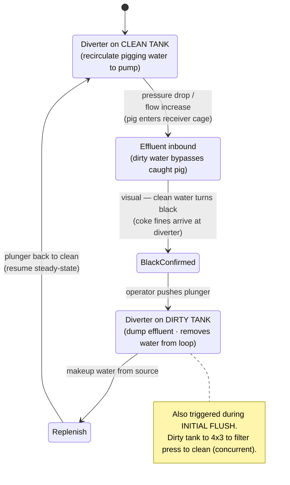
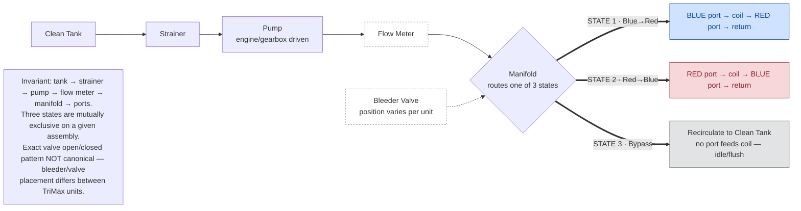

# Equipment Circuit Diagrams

One logical group: how the pumper moves water. Each diagram carries its scope
note from the source, stating what it asserts and what it leaves variable.
Diagrams 2, 4, and 7 live with core/sop and are not duplicated here.

---

## Diagram 1 — Master Flow Circuit

**Scope:** Full closed-loop circuit for one assembly, standard Blue→Red feed direction. Color is bonded to port/endpoint identity (Blue=CONV, Red=RAD), not to feed/return. Filtration shown as an independent concurrent sub-loop. One assembly drawn; TriMax carries 3 identical ones sharing both tanks. Diverter logic detailed separately in Diagram 6.

---

## Diagram 3 — Port / Direction / Color Map

**Scope:** Color is bonded to PORT IDENTITY (Blue=CONV, Red=RAD), fixed. The valve manifold selects which port feeds — no hose swapping. Blue and Red never move; only the feed/return assignment flips. Blue→Red is the standard direction.

---

## Diagram 5 — Circuit Capacity & Scaling

**Scope:** How circuit count maps to equipment. One TriMax handles up to 3 simultaneous circuits. Beyond 3, either mobilize a second TriMax (urgent, all-at-once) or change over (clean 3, rig-over, clean next 3 — roughly doubles decoke duration). Terminology: "second TriMax," never "dual-pumper."

---

## Diagram 6 — Diverter State Machine

**Scope:** Corrects the passive-clarity model. The diverter is operator-driven on a per-pig-run phase trigger, not a continuous clarity sensor. Rests on clean tank during steady-state recirculation; thrown to dirty on the capture→black-confirm sequence and during initial flush.

---

## Diagram 8 — Generic Feed Assembly + 3 Flow States

**Scope:** Invariant feed-side assembly order with the three routable, mutually-exclusive states (Blue→Red, Red→Blue, Bypass). Exact valve open/closed patterns are deliberately NOT encoded — bleeder and valve placement vary between TriMax units, so a canonical valve-state table would be wrong for some units. Bypass recirculates to the clean tank with no port feeding the coil (idle/flush state).

