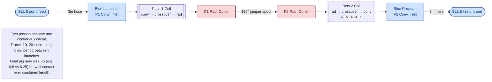
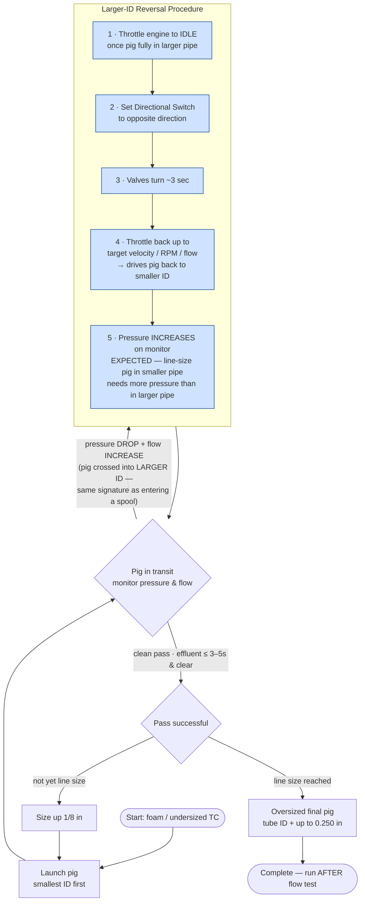

# SOP Pigging Diagrams

Two pigging-procedure diagrams, extracted verbatim from B1 with their scope notes. D4 is clean canon.
In D7, only the reversal **control-action sequence** (the S1–S5 throttle/switch/re-throttle order) is
draft pending field confirmation — see the field-verification note below. Everything else in D7 is canon.

---

## Diagram 4 — Looped Circuit (Jumper Spool)

**Scope:** A 180° jumper spool bonds the radiant outlets of two passes into one continuous circuit. Pass 2 runs reversed. Color stays bonded to port identity (both conv ends are Blue). Combined length extends transit and the blind period; final pig may size up for wall contact.

---

## Diagram 7 — Pig Progression + Larger-ID Reversal Procedure

**Scope:** Smallest-ID-first strategy with progressive 1/8" sizing. Encodes the SINGLE reversal procedure triggered when a pig crosses into a larger ID (pressure drop + flow increase — same signature as entering a spool). The subsequent pressure rise is the EXPECTED confirmation that the pig is back in the smaller ID (line-size pig in smaller pipe needs more pressure), not a separate fault.

> **Field-verification note:** the reversal control sequence (throttle / directional switch / re-throttle) was built from Jesse's description. Confirm exact control-action order with a field operator before treating as canonical — procedural muscle-memory sequences are where paraphrase can drift.

